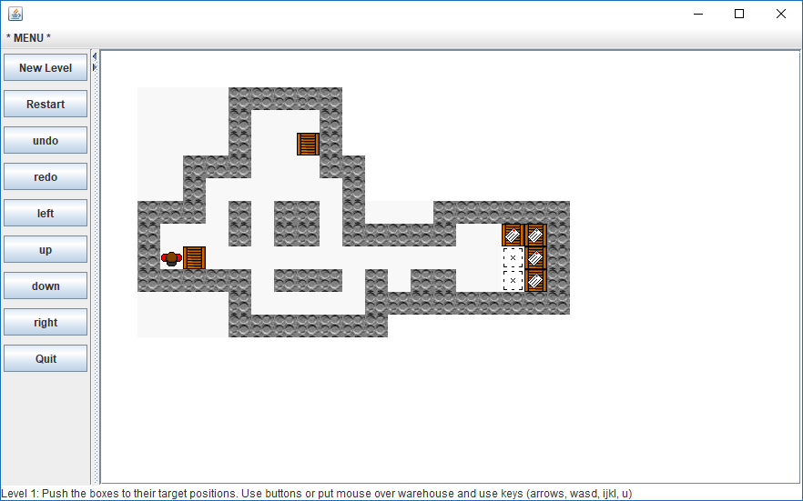
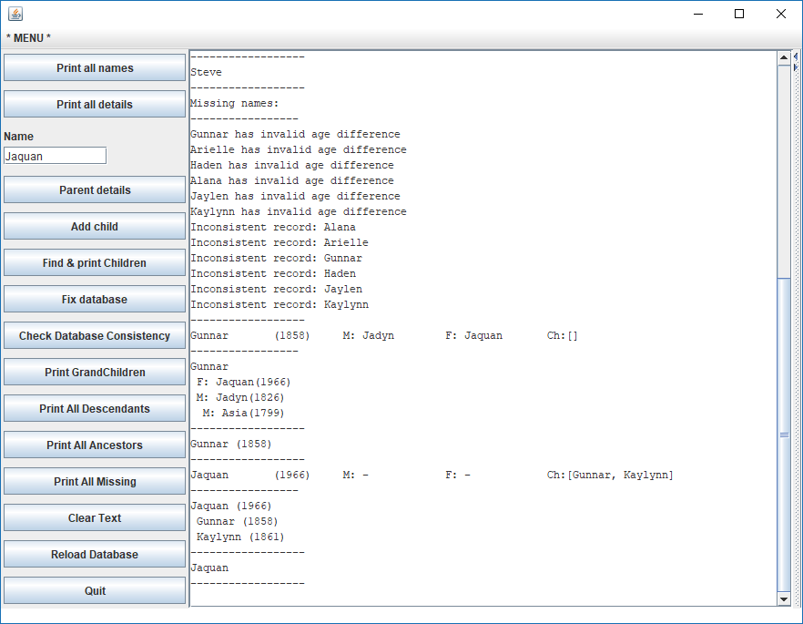
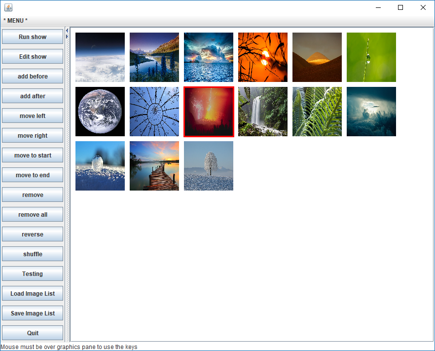
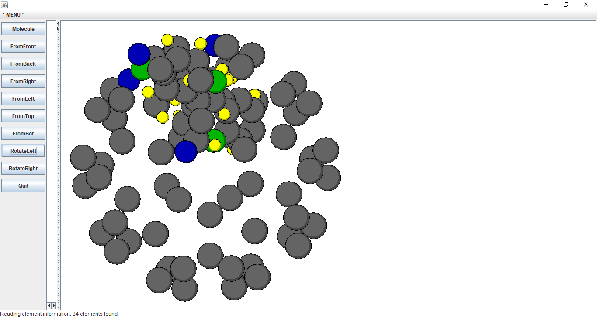
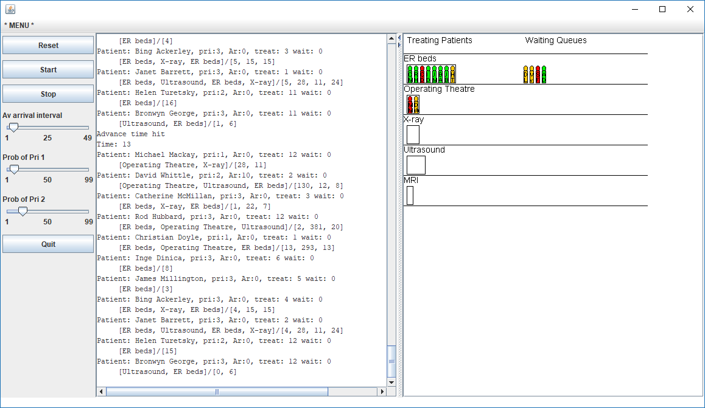
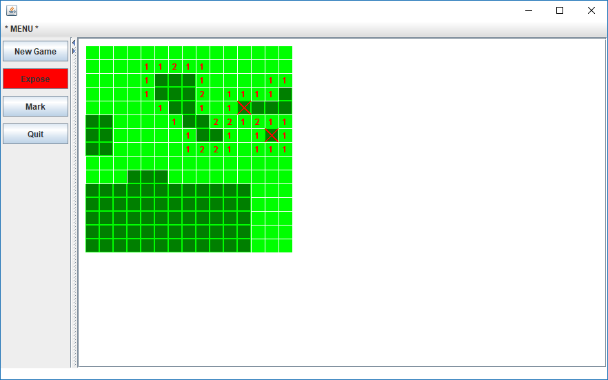
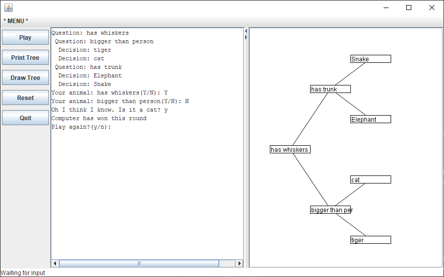
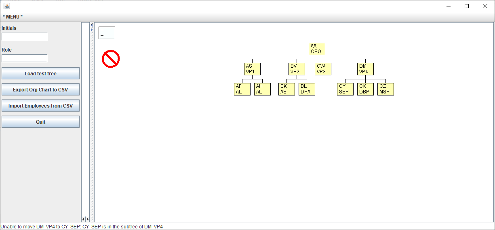

# COMP 103 - Introduction to Datastructures and Algorithms 
https://www.victoria.ac.nz/courses/comp/103/2018/offering?crn=945

## Course learning objectives
Students who pass this course will be able to:
1. Read and write programs using standard collections (sets, lists, bags, stacks, queues, priority queues, maps)
2. Read and write programs using linked data structures, particularly tree structures
3. Read and write programs using recursion
4. Understand ideas of algorithm complexity, do approximate analysis of simple programs with collections, and make efficient design decisions
5. Recognise, understand and use a selection of basic algorithms

## Note
This document covers projects and assignments made while studying COMP103 - Datastructures and Algorithms. 

The source files are unable to be published to the public to help ensure academic integrity and due to copyright concerns involved with the assignment scaffolding.

# Assignments

## Sokoban

### Purpose - Implement an undo, redo and pathfinding within Sokoban
### Intro
Sokoban is a computer game of the puzzle variety that was created in 1980, and is available on many computer platforms. The game involves controlling a worker in a warehouse who has to push boxes around the warehouse to get them onto their destination spots. The worker can only push one box at a time, and cannot pull boxes. It is easy for the player to get stuck in a deadlock where it is no longer possible to move some of the boxes. Some of the levels are extremely difficult to solve.

You can find out more about the Sokoban game from the web.
### Details
Given a simple implementation of the Sokoban game with four levels I added the additional functions.
+ Added an undo function
+ Added a redo function
+ Able to pathfind from the current position of the worker to a free cell clicked on by the user, if there was a possible path.

## Genealogy 

### Purpose - Display Genealogy information
### Intro
Genealogy is a program for a simple genealogical database. The database contains information about many people, including their name, year of birth, the names of their parents (if known), and the names of their children (if known). Unlike real genealogical databases, this one has very "clean" data. In particular, every person has a unique name! It is also simple so that it doesn't record marriages or dates other than year of birth.

The data is stored in a file named database.txt that contains one line for each person in the database. The file has names of the person's parents, when known, but doesn't have any names of their children. The information in the file should be loaded into a Map where the key is the name of a person, and the value is a Person object that contains the information about that person.

### Details
Given a simple and incomplete implementation of the Genealogy program I added or completed the additional functions.

+ Load data from file 
+ Print all details - full details of ever person in the database
+ Select or add a person them if they don't exist
+ Print children, grandchildren and parents
+ Automatically fix the database (Updating children of parent based on children's parents - some of the file details were incorrect)
+ Find and print any missing parents or children which do not exist in the database (eg. children referenced in the parents entry, not listed in the database)
+ Print out ancestry trees and descendant trees

I was also able to implement consistency checks including
+ No one should be born before either of their parents.
+ The parents' ages should not be too far apart
+ No one should be their own ancestor.

## Slideshow

### Purpose - Display a slideshow and allow it to be edited in different ways
### Details
Given a simple and incomplete implementation of the Slideshow program I added or completed the following features.

### Editing
+ Display the list of thumbnail images. The thumbnails should be displayed left to right, in COLUMNS columns.
+ Highlight the currently selected image (eg, by drawing a red rectangle around it).
+ Enable the user to add a new image before the currently selected image.
+ Enable the user to delete the currently selected image, and to remove all images.
+ Enable the user to move the currently selected image to the left, to the right, to the beginning, or to the end of the list.
+ Enable the user to change which image is selected (see the hints in the doKey method).
+ Enable the user to add a new image file name after the currently selected image
+ Enable the user to reverse the order of the images in the list, and to shuffle them randomly. (Look for useful methods in the Collections class.)
+ Enable the user to use the mouse to select an image or to move an image to another position in the list.
### Running
+ Complete the runShow method so that it starts a loop to repeatedly display the currently selected image then, after one second, move to the next image.
+ Complete the editShow method to stop the show running, and display the list of all thumbnails again.

## Molecule Renderer

### Purpose - Display a molecule in 3d from different perspectives

### Intro
For this question, you are to complete a program that draws 3D representations of molecules drawing the atoms in a molecule as colored circles on the graphics pane. To help the user see the 3D shape of the molecule, the program can draw the molecule from six different directions.

The program involves Maps, Lists, and Sorting.

### Details

The shape of molecules can be very important for understanding their function, especially for large biological molecules. Using X-ray crystallography and other techniques, chemists or biochemists can identify the structure of a molecule by identifying the (x, y, z) coordinates of each atom in the molecule. However, tables of values are hard to make sense of, and it is better to be able to visualise the molecule by presenting a graphical rendering of the atoms. Because molecules are 3D shapes, is is hard to make sense of them with just one viewpoint – a good visualisation will allow a user to view the molecule from different directions.

The MoleculeRenderer program produces a simple visualisation that draws each atom in a molecule as a coloured circle. To ensure a correct 3D visualisation, the atoms that are further from the viewer are drawn first, and then the atoms that are closer to the viewer, so atoms in front will cover atoms behind. The MoleculeRenderer program also lets the user view the molecule from the front, back, left, right, top, and bottom.

The MoleculeRenderer program reads a specification of the atoms in a molecule and then renders the molecule on the screen, allowing the user to view the molecule from different directions. There are several molecule files including acetone, a small part of the hemoglobin protein, a buckyball (an unusual form of Carbon), and curcumin (a critical component of Turmeric).

## Emergency Room Simulator

### Purpose - Simulate an emergency room

### Introduction
The EmergencyRoom program is a tick-based simulation of patients in the emergency room of a hospital. Patients arrive, and then move through a series of treatments in different departments - X-ray, MRI, Operating Theatre, etc. When they have finished all their treatments, they are discharged.

Each department only has facilities to treat a fixed number of patients at any one time; if there are more patients than that, they have to wait in the waiting room of the department until a current patient has finished their treatment.

Patients can have different priorities, which are assigned when they arrive at the emergency room.

### Details
Given a simple and incomplete implementation of an Emergency room simulator I implement the additional functions.
+ Created constructors for different departments
+ Using a priority queue to simulate how patients should be prioritized and how this would impact wait times
+ Create custom departments to be added to the simulation
+ Created reports based on the performance of the simulated emergency room

## Minesweeper

### Purpose - Minesweeper Game

### Intro
Minesweeper is a very old video game in which the player tries to work out where the mines are hidden on a grid. Each cell in the grid starts off as hidden (dark green). The player can mark any hidden cell that they think contains a mine, and can expose any hidden cell that they think is safe.

### Details
Given a simple and incomplete implementation of a Minesweeper game I implement the additional functions.
+ If the player exposes a cell with a mine, they lose and the game is over. All the cells are opened up so that the player can see where all the mines are.
+ If the player exposes a safe cell that is next to one or more mines, then the cell displays a number saying how many of the eight surrounding cells contain a mine.
+ If the player exposes a safe cell that is not next to a mine, then it "spreads" to all the connected cells that are also safe, and exposes them also. This was completed using recursion. 

## Animal Game

### Purpose - Use a decision tree to play the Animal Game

### Intro
The Animal Game program uses a decision tree for guessing the animal that the player is thinking of based on the player's answers to a series of questions. The game should start by asking the question in the root node, then follow the answer to the next node, ask the question in that node, and work down tree until it gets to a leaf node. The leaf node will contain the name of an animal which will be the program's guess.

### Details 
Given an incomplete implementation of the Animal Game game I implement the additional functions.
+ Able to ask questions and guess answers
+ Able to extend the tree with yes/no questions 
+ Able to print the decision tree
+ Able to draw the decsision tree

## Organisation Chart

### Purpose - Allow for an organisation chart to be displayed and edited

### Intro
Many organisations are structured in a hierarchy with a CEO at the top, and then all the other employees below in a management hierarchy.

You are to complete the OrganisationChart program which allows the user to display and edit a chart of an organisation structure that displays the structure as a tree of employees with the CEO at the root of the tree. The links in the tree represent the management structure.

The main data structure in the program is a general tree of Employee objects, where the tree structure is stored directly in the fields of the Employee objects.

### Details 
Given an incomplete implementation of an organisation chart program I implemented the additional functions.
+ Add and remove employees from the tree
+ Retire line managers while keeping their position
+ Save and load employees and thier relationships to a CSV file
+ Automatically draw the Org Chart